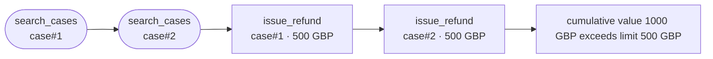

# Running it in CI

The gate is a handful of commands and a set of flags. This is what to wire
where, and which decisions were deliberate.

## The action

```yaml
- uses: mrwersa/agentmandate@v0.8.0
  with:
    manifest: mandate.yaml
    baseline: mandate-released.yaml   # optional: did this widen authority?
    source: src/agent                 # optional: has the manifest drifted?
```

The counterexample lands in the job summary as a rendered graph rather than a
log line, and `sarif-file` is an output you hand to
`github/codeql-action/upload-sarif` so it annotates the diff.

Uploading is deliberately your step, not the action's: it needs
`security-events: write`, and an action that asks for a token permission it
could avoid is one more reason for a security team to say no.

`fail-on: never` reports without blocking, which is how to turn this on over
an existing repository without stopping everyone on the first day.

Only the checks you give inputs for run. A manifest alone is enough for `lint`
and `reach`.

## Findings where you already look

```yaml
# .github/workflows/agent-authority.yml
- run: mandate reach mandate.yaml --sarif > authority.sarif
  continue-on-error: true          # let the upload happen, then fail the gate
- uses: github/codeql-action/upload-sarif@v3
  with:
    sarif_file: authority.sarif
- run: mandate reach mandate.yaml   # the actual gate
```

The breach is then annotated on the pull request that introduced it, rather
than sitting in a log somebody has to open. Findings are `error`, not
`warning`: they already exit non-zero, and a UI that disagrees with the exit
code is how a gate stops being believed.

`--graph` emits Mermaid, which GitHub renders inline in a comment:



One node per **step**, not per tool, because the same tool called twice on
different bindings is usually the whole point. Rounded is a read, boxed
changes something.

## The diff gate, without the action

In a pull request, the useful gate is `diff` against the manifest on the
default branch, so a change that widens authority stops and gets a named
reviewer:

```yaml
- name: Authority diff
  run: |
    git show origin/main:mandate.yaml > /tmp/released.yaml
    mandate diff /tmp/released.yaml mandate.yaml
```

## Pinning the analyzed authority artifact

When separate jobs review and analyze a mandate, pass the canonical snapshot
rather than reparsing an unbound copy:

```yaml
- run: mandate ir export mandate.yaml > authority-ir.json
- run: mandate ir validate authority-ir.json
- run: mandate reach --ir authority-ir.json --json > authority-result.json
```

Reviewed conditional authority stays separate from the manifest. Validate the
artifacts structurally, then supply the reviewed context and its captured bytes
with an explicit evaluation date:

```yaml
- run: mandate conditions validate --condition reviewed-condition.json
- run: mandate conditions validate --context reviewed-context.json
- run: >-
    mandate reach mandate.yaml
    --condition reviewed-condition.json
    --condition-context reviewed-context.json
    --condition-capture reviewed-context.capture
    --condition-as-of 2027-01-01
```

The same four flags apply to `mandate drift`. Repeat condition inputs as
needed; pair every context with one capture in the same argument order. SARIF,
Mermaid, and `reach --ir` composition are intentionally refused until those
formats can carry unresolved condition evidence without implying a clean run.

Delegation evidence uses the same validate-then-consume boundary. Capture
arguments map each reviewed locator to local bytes explicitly; the command
never follows a locator or reads the clock:

```yaml
- run: mandate delegations validate --attachment reviewed-attachment.json
- run: mandate delegations validate --chain reviewed-chain.json
- run: >-
    mandate reach mandate.yaml
    --delegation-attachment reviewed-attachment.json
    --delegation-chain reviewed-chain.json
    --delegation-capture docs/evidence/capture.json=reviewed-capture.json
    --delegation-as-of 2027-01-01T12:00:00Z
    --delegation-target-source deploy/agent.py
    --delegation-target-binding agent
```

Repeat attachment, chain, and locator mappings as needed. Delegation findings
support human and JSON output; SARIF, Mermaid, `reach --ir`, and conditional
composition fail before output rather than dropping uncertainty.

Finite-producer evidence follows the same boundary. Validation proves record
structure only. Reachability separately checks the exact deployment selection,
all caller-mapped source bytes, complete monotone run, accepted review, expiry,
and existing manifest producer:

```yaml
- run: mandate producers validate reviewed-boundary.json
- run: >-
    mandate reach mandate.yaml
    --producer-boundary reviewed-boundary.json
    --producer-source evidence/catalogue.json=catalogue.json
    --producer-source evidence/outcomes.json=outcomes.json
    --producer-source evidence/adapter.py=adapter.py
    --producer-selection '{"source":"evidence/adapter.py","binding":"mint_token","producer":"reviewed.provider","producer_version":"1.0","partition_argument":"tenant","partition_binding":"reviewed-tenant","output_scope":"token"}'
    --producer-as-of 2026-09-03
    --json
```

Repeat boundaries, locator mappings, and explicit selection objects as needed.
An unresolved producer finding writes the complete
`agentmandate.producers/v1` result and exits 1. Malformed records or selections,
invalid dates, missing or conflicting mappings, and undeclared locators exit 2
with empty stdout. Authority IR, SARIF, Mermaid, condition, and delegation
composition also fail before reading inputs or writing partial authority.

Managed Cedar evidence also separates structural validation from trusted
consumption. Source roots are explicit; the command reads exactly the locators
declared by each oracle and refuses paths that escape the root:

```yaml
- run: mandate cedar validate baseline-oracle.json
- run: mandate cedar validate candidate-oracle.json
- run: >-
    mandate cedar diff mandate.yaml
    --baseline-oracle baseline-oracle.json
    --baseline-root evidence/baseline
    --candidate-oracle candidate-oracle.json
    --candidate-root evidence/candidate
    --as-of 2027-01-01
    --json
```

The diff compares only identical canonical requests under one reviewed
enforcement boundary. A widening, tightening, per-request Deny, or unresolved
trust finding writes the complete result and exits 1. Invalid dates, malformed
records, missing files, and unsafe roots exit 2 with empty stdout. The command
does not fetch policy stores or evaluate Cedar source text.

`ir validate` is a structural transport check and exits 0 even when evidence is
contested or heuristic. `reach --ir` is the trust boundary: unsupported
adapters, predicates, value shapes, or non-exact/non-accepted evidence exit 2
without writing partial JSON. A reachable breach still writes the complete
canonical result and exits 1.

## Exit codes

Every analysis command takes `--json` and exits non-zero on a finding, so they
drop into CI unchanged. `scan` writes a manifest to standard output and is a
one-off, not a gate.

| Exit code | Meaning |
|---|---|
| `0` | Clean |
| `1` | A finding: lint error, reachable breach, unresolved producer evidence, widening diff, or a non-conformant replay |
| `2` | Usage or I/O error, malformed manifest/IR/attachment, unsupported composition, version, or analysis profile |
