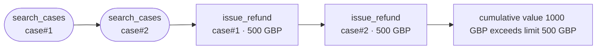

# Running it in CI

Start with a reviewed manifest. Run `lint` and `reach` on every pull request;
add a baseline for `diff` and source for `drift` when those inputs are available.
Begin with `fail-on: never` to review findings before enabling blocking checks.

`diff` compares declared call budgets as well as reachable authority. Raising
or removing a `limits.effects` entry is widening even when no new breach appears
or removing the limit makes its breach disappear. Inspect the allowance change
and breach diagnostics separately; a tighter allowance can expose a new breach
that still requires review under the existing combined verdict.

Choose a search depth and keep `truncated` visible in reachability JSON.
`reach` exits 1 for a breach; truncation alone can still exit 0. If the gate
requires an exhaustive result for the declared model, additionally require
`truncated == false`. Timeouts and memory exhaustion are incomplete analysis,
not clean results. The [search bounds guide](search-performance.md) explains
the measured costs and the resource limits a CI wrapper must enforce.

Use [repair candidates](remediation.md) to investigate a breached manifest.
`mandate remediate` reports the original breach and still exits 1 when a
candidate is found. It never edits the policy or turns a failing baseline into
a passing CI result. Exit 0 also requires baseline lint to have no errors;
candidate reachability and remaining lint are reported separately.

## The action

```yaml
- uses: mrwersa/agentmandate@v0.8.0
  with:
    manifest: mandate.yaml
    baseline: mandate-released.yaml   # optional: did this widen authority?
    source: src/agent                 # optional: has the manifest drifted?
```

The counterexample lands in the job summary as a rendered graph rather than a
log line, and `sarif-file` is an output you hand to
`github/codeql-action/upload-sarif` so it annotates the diff.

Uploading is deliberately your step, not the action's: it needs
`security-events: write`, and an action that asks for a token permission it
could avoid is one more reason for a security team to say no.

`fail-on: never` reports without blocking, which is how to turn this on over
an existing repository without stopping everyone on the first day.

Only the checks you give inputs for run. A manifest alone is enough for `lint`
and `reach`.

## Findings where you already look

```yaml
# .github/workflows/agent-authority.yml
- run: mandate reach mandate.yaml --sarif > authority.sarif
  continue-on-error: true          # let the upload happen, then fail the gate
- uses: github/codeql-action/upload-sarif@v3
  with:
    sarif_file: authority.sarif
- run: mandate reach mandate.yaml   # the actual gate
```

The breach is then annotated on the pull request that introduced it, rather
than sitting in a log somebody has to open. Findings are `error`, not
`warning`: they already exit non-zero, and a UI that disagrees with the exit
code is how a gate stops being believed.

`--graph` emits Mermaid, which GitHub renders inline in a comment:


```mermaid
flowchart LR
  s0(["search_cases<br/>case#1"])
  s1(["search_cases<br/>case#2"])
  s0 --> s1
  s2["issue_refund<br/>case#1 · 500 GBP"]
  s1 --> s2
  s3["issue_refund<br/>case#2 · 500 GBP"]
  s2 --> s3
  breach["cumulative value 1000 GBP exceeds limit 500 GBP"]
  s3 --> breach
```

One node per **step**, not per tool, because the same tool called twice on
different bindings is usually the whole point. Rounded is a read, boxed
changes something.

## The diff gate, without the action

In a pull request, the useful gate is `diff` against the manifest on the
default branch, so a change that widens authority stops and gets a named
reviewer:

```yaml
- uses: actions/checkout@v4
- name: Authority diff
  run: |
    git fetch origin main
    git show origin/main:mandate.yaml > /tmp/released.yaml
    mandate diff /tmp/released.yaml mandate.yaml
```

This assumes AgentMandate is installed in the job and `main` is your default
branch. The fetched manifest must exist and be the baseline you intend to
review; change the branch or use a reviewed release ref when appropriate.

## Named review records

`mandate review` adds a separate gate for recorded acceptance of the exact
bounded diff. It requires named ownership, pinned decision evidence, policy
disposition and an explicit evaluation date:

```bash
mandate review released.json proposed.json --decision reviewed-change.json --source decision-note=reviewed-note.txt --as-of 2026-10-10 --json
```

In CI, replace that demonstration date with today's UTC date supplied by the
trusted workflow. Authenticate and authorize the human review outside the
library, and load decisions and their sources from protected review materials.
Candidate-authored files cannot approve themselves. The [review guide](change-review.md)
defines the format, trust requirements and expiry behavior.

Exit 0 means the recorded acceptance is eligible, or no widening needs review
within the comparison bound. It does not clear the proposed manifest's breach:
`diff` still exits 1 for widening, and `reach` still exits 1 for that breach.
Run `lint` and `reach` independently. Do not replace a failing reach gate with
a successful review-record gate or treat pinned policy notes as live enforcement.

## Pinning the analyzed authority artifact

When separate jobs review and analyze a mandate, pass the canonical snapshot
rather than reparsing an unbound copy:

```yaml
- run: mandate ir export mandate.yaml > authority-ir.json
- run: mandate ir validate authority-ir.json
- run: mandate reach --ir authority-ir.json --json > authority-result.json
```

Reviewed conditional authority stays separate from the manifest. Validate the
artifacts structurally, then supply the reviewed context and its captured bytes
with an explicit evaluation date:

```yaml
- run: mandate conditions validate --condition reviewed-condition.json
- run: mandate conditions validate --context reviewed-context.json
- run: >-
    mandate reach mandate.yaml
    --condition reviewed-condition.json
    --condition-context reviewed-context.json
    --condition-capture reviewed-context.capture
    --condition-as-of 2027-01-01
```

The same four flags apply to `mandate drift`. Repeat condition inputs as
needed; pair every context with one capture in the same argument order. SARIF,
Mermaid, and `reach --ir` composition are intentionally refused until those
formats can carry unresolved condition evidence without implying a clean run.

Delegation evidence uses the same validate-then-consume boundary. Capture
arguments map each reviewed locator to local bytes explicitly; the command
never follows a locator or reads the clock:

```yaml
- run: mandate delegations validate --attachment reviewed-attachment.json
- run: mandate delegations validate --chain reviewed-chain.json
- run: >-
    mandate reach mandate.yaml
    --delegation-attachment reviewed-attachment.json
    --delegation-chain reviewed-chain.json
    --delegation-capture docs/evidence/capture.json=reviewed-capture.json
    --delegation-as-of 2027-01-01T12:00:00Z
    --delegation-target-source deploy/agent.py
    --delegation-target-binding agent
```

Repeat attachment, chain, and locator mappings as needed. Delegation findings
support human and JSON output; SARIF, Mermaid, `reach --ir`, and conditional
composition fail before output rather than dropping uncertainty.

Finite-producer evidence follows the same boundary. Validation proves record
structure only. Reachability separately checks the exact deployment selection,
all caller-mapped source bytes, complete monotone run, accepted review, expiry,
and existing manifest producer:

```yaml
- run: mandate producers validate reviewed-boundary.json
- run: >-
    mandate reach mandate.yaml
    --producer-boundary reviewed-boundary.json
    --producer-source evidence/catalogue.json=catalogue.json
    --producer-source evidence/outcomes.json=outcomes.json
    --producer-source evidence/adapter.py=adapter.py
    --producer-selection '{"source":"evidence/adapter.py","binding":"mint_token","producer":"reviewed.provider","producer_version":"1.0","partition_argument":"tenant","partition_binding":"reviewed-tenant","output_scope":"token"}'
    --producer-as-of 2026-09-03
    --json
```

Repeat boundaries, locator mappings, and explicit selection objects as needed.
An unresolved producer finding writes the complete
`agentmandate.producers/v1` result and exits 1. Malformed records or selections,
invalid dates, missing or conflicting mappings, and undeclared locators exit 2
with empty stdout. Authority IR, SARIF, Mermaid, condition, and delegation
composition also fail before reading inputs or writing partial authority.

Authority continuity remains separate from reachability. Validation checks one
record's structure; reconciliation verifies every declared source byte and an
optional mandate binding before deciding whether consumed authority safely
survived each named transition:

```yaml
- run: mandate continuity validate provider.json
- run: mandate continuity validate binding.json
- run: >-
    mandate continuity reconcile mandate.json
    --continuity-provider provider.json
    --continuity-source evidence/provider.json=provider-capture.json
    --continuity-binding binding.json
    --continuity-binding-source evidence/verification.json=verification.json
    --continuity-binding-source evidence/policy.json=policy.json
    --continuity-as-of 2026-09-03T12:00:00Z
    --json
```

The command exits 0 only when every transition has
`safe_continuation: satisfied`. A violated or unresolved transition writes the
complete `agentmandate.continuity/v1` result and exits 1. Malformed or
incomplete artifacts and mappings exit 2 with empty stdout. IR, SARIF,
Mermaid, OTel, condition, delegation, producer, and Cedar composition is
refused before any input is read.

The separate [principal observation](principal-continuity.md) and
[reviewed accounting](principal-accounting.md) results always exit 1 because
continuation safety remains unresolved. Accounting can report observed spend
above a mandate limit; an amount below it is not permission to deploy or
continue. Keep these results separate from a clean continuity gate.

`--continuity-review` with `--continuity-review-source` selects the separate
[revision-review envelope](revision-review.md). It retains the original
continuity baseline and always exits 1: eligible scoped comparison and issuer
treatment are not a global safe-continuation gate.

The separate [scalar handover](scalar-handover.md) gate checks conformance to
a closed monetary model at cutover. Supply both reviewed bindings in the
artifact and map every declared source:

```yaml
- run: mandate continuity validate handover.json
- run: >-
    mandate continuity handover mandate.json handover.json
    --source evidence/before-policy.json=before-policy.json
    --source evidence/after-policy.json=after-policy.json
    --source evidence/review.json=review.json
    --as-of 2026-10-10T00:00:00Z
    --json
```

Exit 0 requires all scalar handover obligations and clean, untruncated manifest
Authority. It establishes next-request inclusion in the declared model, not
global provider safe continuation. Eligible violations and unresolved evidence
exit 1 with complete output; malformed artifacts, locator errors, and I/O
failures exit 2 with empty stdout. Use the [runnable example](../examples/scalar-handover/README.md)
to check the positive and negative paths before adopting this narrower gate.

Managed Cedar evidence also separates structural validation from trusted
consumption. Source roots are explicit; the command reads exactly the locators
declared by each oracle and refuses paths that escape the root:

```yaml
- run: mandate cedar validate baseline-oracle.json
- run: mandate cedar validate candidate-oracle.json
- run: >-
    mandate cedar diff mandate.yaml
    --baseline-oracle baseline-oracle.json
    --baseline-root evidence/baseline
    --candidate-oracle candidate-oracle.json
    --candidate-root evidence/candidate
    --as-of 2027-01-01
    --json
```

The diff compares only identical canonical requests under one reviewed
enforcement boundary. A widening, tightening, per-request Deny, or unresolved
trust finding writes the complete result and exits 1. Invalid dates, malformed
records, missing files, and unsafe roots exit 2 with empty stdout. The command
does not fetch policy stores or evaluate Cedar source text.

`ir validate` is a structural transport check and exits 0 even when evidence is
contested or heuristic. `reach --ir` is the trust boundary: unsupported
adapters, predicates, value shapes, or non-exact/non-accepted evidence exit 2
without writing partial JSON. A reachable breach still writes the complete
canonical result and exits 1.

## Exit codes

Every analysis command takes `--json` and exits non-zero on a finding, so they
drop into CI unchanged. `scan` writes a manifest to standard output and is a
one-off, not a gate.
`inventory import` likewise writes an unreviewed declaration or inventory IR;
exit 0 means extraction succeeded. `inventory validate` proves structure only.
Use the reviewed [dynamic-inventory workflow](dynamic-inventory.md) with
`drift` to evaluate membership evidence, not the importer as a deployment gate.

| Exit code | Meaning |
|---|---|
| `0` | Clean |
| `1` | A finding: lint error, reachable breach, unresolved producer evidence, widening diff, or a non-conformant replay |
| `2` | Usage or I/O error, malformed manifest/IR/attachment, unsupported composition, version, or analysis profile |
