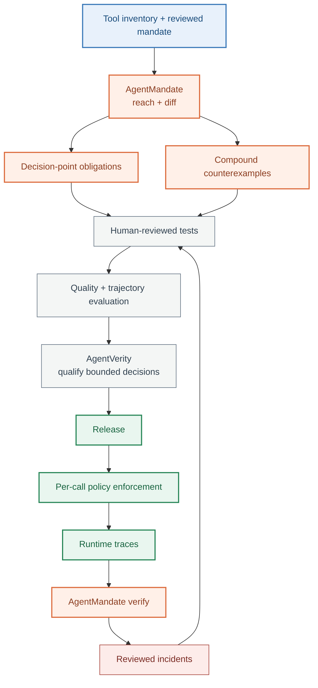

# AgentMandate in the evaluation loop

Agent evaluation asks what the system did and whether the result was good.
Authority analysis asks a prior question: what could the deployed tool graph
permit the system to do?

Use both:



The loop has two distinct control points. The model proposes a call, while the
runtime policy authorises it before the effect. AgentMandate analyses the
reachable sequence before release and checks recorded control evidence after
execution. It is not the model's planner and it is not the runtime policy
engine.

## Claims that must not be collapsed

| Layer | Question | Owner |
|---|---|---|
| Permitted reachability | Can a legal sequence reach a breach under the reviewed mandate description? | `mandate reach` |
| Behaviour | Does the agent choose that path for the reviewed scenario? | Your evaluation harness |
| Enforcement | Does each deployed call satisfy runtime policy? | Cedar, OPA, AgentCore Policy, or another gateway |
| Conformance | Do recorded calls carry and respect the controls the reviewed mandate declares? | `mandate verify` |

A static witness is not a prediction about model behaviour. A passing scenario
does not prove the authority is absent. A clean runtime trace does not prove an
untaken path is impossible.

A fifth, experimental lifecycle claim remains separate from all four: did the
consumed state bounding one reviewed mandate survive a named session, handoff,
or policy transition? Correct per-request decisions and a stable session
identifier do not establish that continuity. Continuity reconciliation handles
this question through `mandate continuity`; it remains
a separate lifecycle result rather than another reachability or runtime-policy
claim.

## Two outputs for two kinds of test

`mandate obligations` handles consequential decision points such as approval
for a refund. After human mapping, those bounded decisions can become an
AgentVerity suite.

`mandate scenarios` handles compound paths. It preserves the structured
counterexample and asks a reviewer for:

- the test fixture and starting state
- the user or system input that should exercise the risk
- the exact control boundary expected to stop the path

Generate a skeleton:

```bash
mandate scenarios mandate.yaml --output scenario-tests.json
```

The command exits `1` when a reachable breach exists, even though it writes the
file. Exit `1` remains a security finding, not a serialization failure.

Edit the three review fields, then reconcile the file against the live
manifest:

```bash
mandate scenarios mandate.yaml \
  --reviewed scenario-tests.json \
  --output scenario-tests-current.json
```

Witnesses that disappeared are removed. Newly reachable witnesses return with
blank review fields. A renamed or materially different path does not silently
inherit an old review.

## Execute elsewhere

The scenario schema is neutral. A team may turn a reviewed row into:

- a pytest environment fixture and async agent call
- a Promptfoo multi-turn scenario
- a LangSmith dataset example and trajectory evaluator
- a managed AgentCore batch evaluation
- an internal red-team or release-gate job

AgentMandate does not import those frameworks or decide how a natural-language
input should provoke the path. Static extraction followed by human annotation
keeps the authority fact separate from application semantics.

## Close the loop carefully

Production traces and incidents are candidates, not automatically trusted test
cases. Review them, remove sensitive content, establish the expected control,
and version the resulting dataset. Use `mandate verify` for recorded control
evidence and the scenario suite for the next offline release evaluation.

Primary references:

- [Anthropic: Demystifying evals for AI agents](https://www.anthropic.com/engineering/demystifying-evals-for-ai-agents)
- [LangSmith evaluation lifecycle](https://docs.langchain.com/langsmith/evaluation)
- [Amazon Bedrock AgentCore evaluation types](https://docs.aws.amazon.com/bedrock-agentcore/latest/devguide/evaluations-types.html)
- [Policy in AgentCore concepts](https://docs.aws.amazon.com/bedrock-agentcore/latest/devguide/policy-core-concepts.html)
