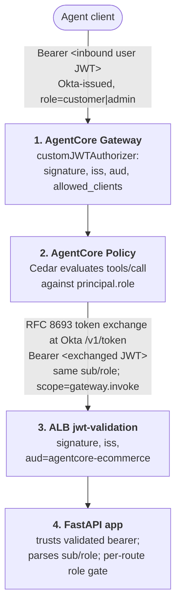

# End-to-end AgentCore Demo

> ⚠️ **WARNING — Proof of concept, development use only.**
>
> This project exists to demonstrate and explore the AgentCore
> authorization flow. It is **not ready for production use** and **must not
> be deployed to a production environment.**

A proof of concept that wires **Amazon Bedrock AgentCore** (Gateway,
Identity, Policy) to an HTTPS backend, with **Okta** as the IdP and
JWT-based authorization end-to-end. Private VPC backend support will
follow once the Terraform provider lands it (see [Out of scope](#out-of-scope)).

The application is a small eCommerce service for gaming consoles. It exposes
six REST APIs split into two roles, customer and admin:

| Role | Tools |
|---|---|
| customer | list products, add to cart, checkout |
| admin | add product, update price, update stock |

Role membership lives in Okta groups. The same `role` claim flows through
every layer of the stack — from Okta into the access token, through
AgentCore Gateway and Cedar policy evaluation, across an RFC 8693 token
exchange, into ALB native JWT validation, and finally into the FastAPI app.


The diagram above traces the request path and the [four authorization
checkpoints](#architecture) end to end. It's generated from
[docs/diagram/architecture.py](docs/diagram/architecture.py) using the
official AWS Architecture Icons — re-render with
`cd docs/diagram && .venv/bin/python architecture.py`.

## What's in here

- **[app/](app/)** — Python / FastAPI eCommerce service. Emits OpenAPI 3.1
  for AgentCore Gateway target import. Trusts the bearer token validated by
  the ALB and parses `sub` / `role`.
- **[infra/](infra/)** — Terraform, split into two stacks under
  [`infra/envs/dev/`](infra/envs/dev/):
  - **[platform/](infra/envs/dev/platform/)** — VPC, RDS, ECS+Fargate, an
    ALB (internet-facing by default for testing — see
    [Out of scope](#out-of-scope)) with native [`jwt-validation`](https://docs.aws.amazon.com/elasticloadbalancing/latest/application/listener-verify-jwt.html),
    Route53, ACM. Deployable standalone.
  - **[agentcore/](infra/envs/dev/agentcore/)** — AgentCore Identity,
    Gateway, and Policy engine. Reads the platform stack via
    `terraform_remote_state`.
- **[scripts/](scripts/)** — helpers for the post-apply CLI shims (see
  [Provider gaps](#provider-gaps)) and for smoke-testing.
- **[docs/](docs/)** — deeper writeups:
  - **[docs/okta-setup.md](docs/okta-setup.md)** — Okta configuration, step
    by step.
  - **[docs/auth.md](docs/auth.md)** — the four authorization checkpoints
    and the two-JWT model in detail.

## Architecture



Cedar is default-deny and the policy engine ships in `ENFORCE` mode. To
dry-run new policies, set `policy_engine_mode = "LOG_ONLY"` in tfvars,
re-attach, and watch decisions land in CloudWatch before flipping back.

See **[docs/auth.md](docs/auth.md)** for what each checkpoint validates,
why two distinct JWTs exist, and the failure-mode reference.

## Deploying

### Prerequisites

- AWS account with admin or equivalent permissions, AWS CLI configured.
- A Route53 hosted zone you control (the ALB needs a publicly-trusted ACM
  cert — see [docs/auth.md → Why ALB TLS must chain to a public CA](docs/auth.md#why-the-albs-tls-cert-must-chain-to-a-public-ca)).
- Okta tenant configured per **[docs/okta-setup.md](docs/okta-setup.md)**.
- Terraform ≥ 1.6, `aws` CLI v2, `jq`, `podman` (or `docker`), `uv`.

### 1. Deploy the platform stack

```bash
cd infra/envs/dev/platform
cp terraform.tfvars.example terraform.tfvars   # fill in Okta + DNS values
terraform init
terraform apply
```

Defaults make the ALB **internet-facing** so you can smoke-test JWT
validation from outside the VPC. The variables `alb_internet_facing = false`
and `alb_ingress_cidrs = []` exist for a fully-private deploy, but that
path has **not** been validated end-to-end yet — AgentCore Gateway → ALB
over private connectivity is the next test on the list.

### 2. Build and push the application image

Use a unique tag per build so Terraform sees a diff and rolls out a new task
definition revision. Reusing `:latest` won't trigger a redeploy.

```bash
ECR_URL=$(terraform output -raw ecr_repository_url)
IMAGE_TAG=$(git rev-parse --short HEAD)   # or: $(date -u +%Y%m%d-%H%M%S)

aws ecr get-login-password | podman login --username AWS --password-stdin "${ECR_URL%/*}"
podman build --platform linux/arm64 -t "${ECR_URL}:${IMAGE_TAG}" ../../../../app/
podman push "${ECR_URL}:${IMAGE_TAG}"

# Wire the new image into tfvars and apply.
sed -i.bak '/^container_image *=/d' terraform.tfvars
echo "container_image = \"${ECR_URL}:${IMAGE_TAG}\"" >> terraform.tfvars
terraform apply
```

### 3. Bootstrap the database

RDS is in private subnets. The bootstrap runs as a one-off Fargate task
inside the VPC, reusing the app's task definition with an overridden
command:

```bash
scripts/bootstrap_remote_db.sh
```

The script tails the bootstrap task's CloudWatch logs and exits with the
task's exit code. Re-runnable — table creation and seed data are both
idempotent.

### 4. Smoke-test the ALB JWT validation

With the ALB internet-facing, you can verify end-to-end JWT validation
before involving AgentCore:

```bash
export OKTA_ISSUER=https://<tenant>.okta.com/oauth2/<authzServerId>
export OKTA_CLIENT_ID=<client-id>
# Either obtain a real user token via PKCE...
export OKTA_ACCESS_TOKEN=$(scripts/get_token.py)
# ...or paste one from Okta's Token Preview tool.

scripts/test_jwt.sh
```

The script hits the ALB with and without the token — expect 200 from the
app on the first call and 401 from the ALB on the second.

### 5. Generate the OpenAPI spec for the Gateway

The Gateway target reads the spec inline at plan time:

```bash
cd app && uv run python ../scripts/export_openapi.py ../openapi.json
```

Re-run whenever the API surface changes.

### 6. Deploy the agentcore stack

```bash
cd infra/envs/dev/agentcore
cp terraform.tfvars.example terraform.tfvars   # fill in Okta values
terraform init
terraform apply
```

The agentcore stack reads the platform stack's outputs automatically. It
provisions everything except the pieces called out in
[Provider gaps](#provider-gaps) below.

### 7. Apply post-`terraform apply` shims

Three pieces of the AgentCore configuration aren't yet expressible in the
Terraform AWS provider — see [Provider gaps](#provider-gaps).

**7a. Create the Cedar policies inside the policy engine** using the
engine ARN and gateway ARN that Terraform output:

```bash
ENGINE_ID=$(terraform output -raw policy_engine_id)
GATEWAY_ARN=$(terraform output -raw gateway_arn)

aws bedrock-agentcore-control create-policy \
  --policy-engine-id "$ENGINE_ID" \
  --name "ecommerce_customer_access" \
  --definition "{\"cedar\":{\"statement\":\"permit(principal is AgentCore::OAuthUser, action in [AgentCore::Action::\\\"ecommerce-tools___list_products\\\", AgentCore::Action::\\\"ecommerce-tools___add_to_cart\\\", AgentCore::Action::\\\"ecommerce-tools___checkout\\\"], resource == AgentCore::Gateway::\\\"$GATEWAY_ARN\\\") when { principal.hasTag(\\\"role\\\") && principal.getTag(\\\"role\\\") == \\\"customer\\\" };\"}}" \
  --validation-mode FAIL_ON_ANY_FINDINGS

aws bedrock-agentcore-control create-policy \
  --policy-engine-id "$ENGINE_ID" \
  --name "ecommerce_admin_access" \
  --definition "{\"cedar\":{\"statement\":\"permit(principal is AgentCore::OAuthUser, action, resource == AgentCore::Gateway::\\\"$GATEWAY_ARN\\\") when { principal.hasTag(\\\"role\\\") && principal.getTag(\\\"role\\\") == \\\"admin\\\" };\"}}" \
  --validation-mode FAIL_ON_ANY_FINDINGS
```

**7b. Attach the policy engine to the gateway** (`ENFORCE` by default,
controlled by `policy_engine_mode` in tfvars):

```bash
scripts/attach_policy_engine.sh
```

**7c. Configure `onBehalfOfTokenExchangeConfig` on the OAuth2 credential
provider** so AgentCore Identity can perform RFC 8693 token exchanges
against Okta. The update API replaces the whole `customOauth2ProviderConfig`
rather than merging, so `oauthDiscovery` and the client credentials must
be re-supplied alongside the new field. Pull them from the agentcore stack's
tfvars so they stay in sync with what Terraform created:

```bash
tfvar() {
  grep -E "^${1}[[:space:]]*=" infra/envs/dev/agentcore/terraform.tfvars \
    | head -1 | sed -E 's/^[^"]*"([^"]*)".*/\1/'
}
TEX_OKTA_ISSUER=$(tfvar okta_issuer)
TEX_OKTA_CLIENT_ID=$(tfvar okta_client_id)
TEX_OKTA_CLIENT_SECRET=$(tfvar okta_client_secret)

aws bedrock-agentcore-control update-oauth2-credential-provider \
  --name agentcore_ecommerce_dev_okta \
  --credential-provider-vendor CustomOauth2 \
  --oauth2-provider-config-input "{
    \"customOauth2ProviderConfig\": {
      \"oauthDiscovery\": {
        \"discoveryUrl\": \"${TEX_OKTA_ISSUER}/.well-known/openid-configuration\"
      },
      \"clientId\": \"${TEX_OKTA_CLIENT_ID}\",
      \"clientSecret\": \"${TEX_OKTA_CLIENT_SECRET}\",
      \"onBehalfOfTokenExchangeConfig\": {
        \"grantType\": \"TOKEN_EXCHANGE\",
        \"tokenExchangeGrantTypeConfig\": { \"actorTokenContent\": \"NONE\" }
      }
    }
  }"
```

Without `onBehalfOfTokenExchangeConfig` the gateway's outbound flow fails
with `OnBehalfOfTokenExchangeConfig is required in the OBO flow`. Omitting
`oauthDiscovery` (or the client credentials) fails the update with
`Missing required parameter in oauth2ProviderConfigInput.customOauth2ProviderConfig`.

Decisions land in `/aws/bedrock-agentcore/gateways/<id>` in CloudWatch.
For a dry-run pass — to inspect what Cedar *would* deny without blocking
calls — set `policy_engine_mode = "LOG_ONLY"` in tfvars and re-run
`scripts/attach_policy_engine.sh`.

## Testing the gateway

End-to-end: derive an inbound user JWT from the **Web Application** Okta
client (step 2a in [docs/okta-setup.md](docs/okta-setup.md)), then point
[MCP Inspector](https://github.com/modelcontextprotocol/inspector) at the
gateway URL with that JWT.

### 1. Derive a user token

[scripts/get_token.py](scripts/get_token.py) runs the Authorization Code +
PKCE flow against Okta and prints the access token to stdout. Use the
**Web Application's** client id and secret here — that's the app
configured for the `Authorization Code` grant and that the gateway
authorizer's `allowed_clients` accepts.

```bash
export OKTA_ISSUER=https://<tenant>.okta.com/oauth2/<authzServerId>
export OKTA_CLIENT_ID=<web-app-client-id>
export OKTA_CLIENT_SECRET=<web-app-client-secret>

TOKEN=$(scripts/get_token.py)
```

A browser window opens for Okta sign-in; sign in as a user assigned to
either `agentcore-demo-customers` or `agentcore-demo-admins`. The script
defaults to scopes `gateway.invoke openid` and a redirect URI of
`http://localhost:8080/callback` — both must be registered on the Web
Application in Okta.

### 2. Connect MCP Inspector to the gateway

Grab the gateway URL Terraform exported from the agentcore stack and
launch the inspector:

```bash
cd infra/envs/dev/agentcore
GATEWAY_URL=$(terraform output -raw gateway_url)

npx @modelcontextprotocol/inspector
```

In the inspector UI:

- **Transport type**: `Streamable HTTP`
- **URL**: `$GATEWAY_URL` from above
- **Authentication** → **Bearer Token**: paste `$TOKEN`

Click **Connect**, then **List Tools**. You should see the six eCommerce
operations from the OpenAPI spec. Invoke one (e.g. `list_products`) — the
call traverses all four checkpoints in
[docs/auth.md](docs/auth.md): gateway authorizer → Cedar → RFC 8693
exchange → ALB jwt-validation → FastAPI.

If the policy engine is in `ENFORCE` and you signed in as a customer,
`add_product` / `update_price` / `update_stock` should return a Cedar
deny. In `LOG_ONLY` every call succeeds; check
`/aws/bedrock-agentcore/gateways/<id>` in CloudWatch to see the decision
Cedar *would* have made.

## Provider gaps

The `hashicorp/aws` provider (v6.47) doesn't yet cover three pieces of the
AgentCore surface:

| Gap | Workaround |
|---|---|
| Attaching a policy engine to a gateway (`UpdateGateway.policyEngineConfiguration`). | [scripts/attach_policy_engine.sh](scripts/attach_policy_engine.sh) |
| Cedar policy text inside a policy engine (no `aws_bedrockagentcore_policy` resource). | `aws bedrock-agentcore-control create-policy` against the engine ARN that Terraform outputs. |
| `onBehalfOfTokenExchangeConfig` on the OAuth2 credential provider. | `aws bedrock-agentcore-control update-oauth2-credential-provider` (see [docs/auth.md → Outbound](docs/auth.md#outbound-rfc-8693-token-exchange-between-2-and-3)). |

None of the gaps affect the security model — they're code-organization
gaps, not authorization gaps.

## Cleaning up

Tear the stacks down in **reverse order of deployment**: agentcore first,
then platform.

> [!IMPORTANT]
> Before running `terraform destroy` in the agentcore stack you **must
> detach the policy engine from the gateway**. The attachment was made
> out-of-band by [scripts/attach_policy_engine.sh](scripts/attach_policy_engine.sh)
> (see [Provider gaps](#provider-gaps)), so Terraform doesn't know about
> it. Destroying the `aws_bedrockagentcore_policy_engine` resource while
> a gateway still references it fails with a dependency error.

### 1. Detach the policy engine from the gateway

Either route is fine — use the AWS console or the CLI.

**Console:** Bedrock AgentCore → Gateways → *your gateway* → **Edit** →
under *Policy engine*, choose **None** → **Save**.

**AWS CLI:** `update-gateway` requires the gateway's existing fields to
be re-passed, so the simplest approach is to fetch the current
configuration and re-submit it without `--policy-engine-configuration`:

```bash
cd infra/envs/dev/agentcore

REGION="$(awk -F'=' '/^aws_region/ {gsub(/[" ]/, "", $2); print $2; exit}' terraform.tfvars)"
GATEWAY_ID="$(terraform output -raw gateway_id)"

GW_JSON="$(aws bedrock-agentcore-control get-gateway \
  --region "${REGION}" --gateway-identifier "${GATEWAY_ID}")"

aws bedrock-agentcore-control update-gateway \
  --region "${REGION}" \
  --gateway-identifier "${GATEWAY_ID}" \
  --name              "$(echo "${GW_JSON}" | jq -r '.name')" \
  --role-arn          "$(echo "${GW_JSON}" | jq -r '.roleArn')" \
  --authorizer-type   "$(echo "${GW_JSON}" | jq -r '.authorizerType')" \
  --authorizer-configuration "$(echo "${GW_JSON}" | jq -c '.authorizerConfiguration')" \
  --protocol-configuration   "$(echo "${GW_JSON}" | jq -c '.protocolConfiguration')"

# Verify — should print null.
aws bedrock-agentcore-control get-gateway \
  --region "${REGION}" --gateway-identifier "${GATEWAY_ID}" \
  --query 'policyEngineConfiguration' --output json
```

### 2. Delete the Cedar policies inside the policy engine

Cedar policies were also created out-of-band (step 7a), so Terraform won't
remove them — and the policy engine resource won't delete while it still
contains policies.

```bash
ENGINE_ID=$(terraform output -raw policy_engine_id)

aws bedrock-agentcore-control list-policies \
  --policy-engine-id "$ENGINE_ID" \
  --query 'policies[].policyId' --output text | tr '\t' '\n' | \
while read -r POLICY_ID; do
  [ -z "$POLICY_ID" ] && continue
  aws bedrock-agentcore-control delete-policy \
    --policy-engine-id "$ENGINE_ID" \
    --policy-identifier "$POLICY_ID"
done
```

### 3. Destroy the agentcore stack

```bash
cd infra/envs/dev/agentcore
terraform destroy
```

### 4. Empty the ECR repository, then destroy the platform stack

Terraform won't delete an ECR repo that still contains images:

```bash
cd infra/envs/dev/platform
ECR_NAME="$(terraform output -raw ecr_repository_url | awk -F'/' '{print $NF}')"
aws ecr batch-delete-image \
  --repository-name "$ECR_NAME" \
  --image-ids "$(aws ecr list-images --repository-name "$ECR_NAME" --query 'imageIds' --output json)"

terraform destroy
```

Route53 / ACM resources are managed by Terraform and will be removed by
the platform destroy. Anything you created manually in Okta (app, authz
server, groups) is out of scope here — clean up in the Okta admin console
if needed.

## Out of scope

- UI / front-end.
- Payments and order fulfilment.
- Token revocation, refresh handling, Okta lifecycle automation.
- Hiding admin tool names from `tools/list` for non-admin callers (Cedar
  enforces `tools/call` only — admin tool names are visible in discovery,
  but invocation is denied).
- Multi-region deployment, observability stack, alerting.
- **Fully-private ALB.** The Terraform variables (`alb_internet_facing`,
  `alb_ingress_cidrs`) are wired up, but the only path tested so far is the
  internet-facing ALB. AgentCore Gateway → fully-private ALB via VPC
  connectivity is on the to-do list. The mechanism (VPC Lattice resource
  gateway, managed or self-managed) is documented in the AWS blog
  [Configuring Amazon Bedrock AgentCore Gateway for secure access to
  private resources](https://aws.amazon.com/blogs/machine-learning/configuring-amazon-bedrock-agentcore-gateway-for-secure-access-to-private-resources/).
  Native Terraform support is in flight — tracking:
  - [hashicorp/terraform-provider-aws#47602](https://github.com/hashicorp/terraform-provider-aws/issues/47602) — *Add support for VPC configuration on `aws_bedrockagentcore_gateway_target`* (issue)
  - [hashicorp/terraform-provider-aws#47885](https://github.com/hashicorp/terraform-provider-aws/pull/47885) — *resource/aws_bedrockagentcore_gateway_target: add private_endpoint support* (PR, open)
